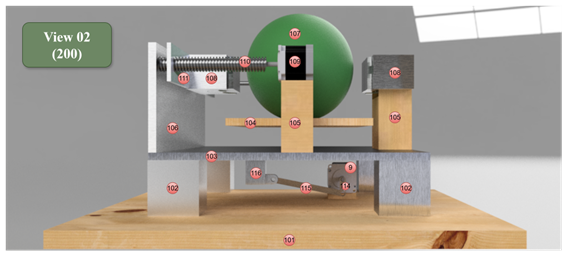
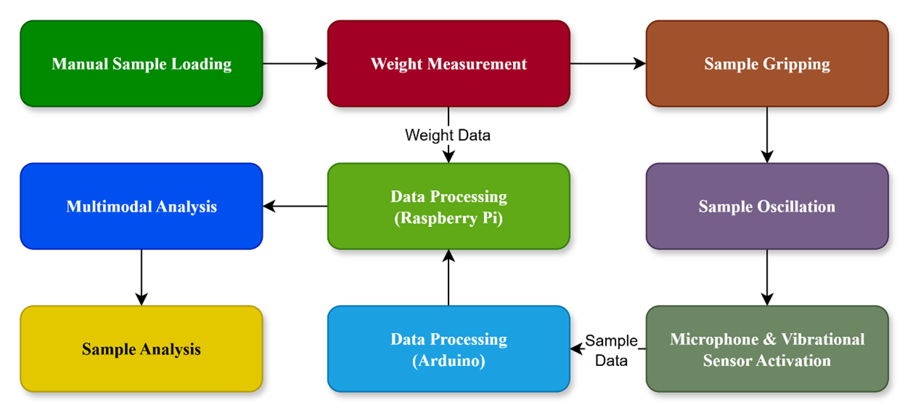
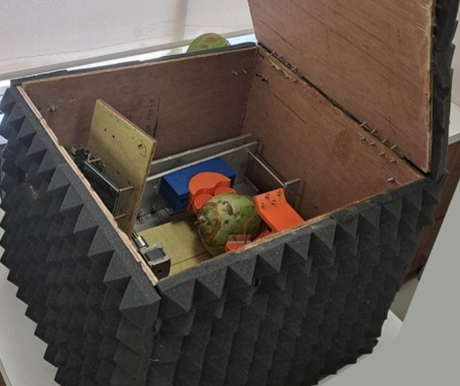

# 🥥 Coconut Maturity Detection Using Acoustic Spectroscopy

> **Patent‑backed Mechanical Design Repository**
> *Non‑destructive testing · Acoustic spectroscopy · Agri‑automation · Mechanical system design*

---

## 📌 Overview

This repository documents the **mechanical design and system architecture** of the patented invention:

> **“Coconut Maturity Detection Using Acoustic Spectroscopy”**
> Applicant: **Symbiosis International (Deemed University)**
> Filed under *The Patents Act, 1970 (India)*

The invention presents a **non‑destructive, low‑cost acoustic spectroscopy system** for determining coconut maturity by analysing sound and vibration responses generated through **controlled oscillatory motion**. Unlike manual tapping or invasive methods, this system provides **objective, repeatable, and field‑deployable maturity classification** suitable for food processing industries.

⚠️ *This repository is shared strictly for academic, research, and design‑review purposes and is associated with a patented invention.*

---

## 🎯 Core Contributions

* Design of a **mechanically actuated acoustic spectroscopy device** for thick‑shelled fruits
* Introduction of a **fractal vise gripping mechanism** for secure, non‑destructive holding
* Controlled **oscillatory excitation** to activate internal coconut water dynamics
* Integration‑ready architecture for **acoustic, vibrational, force, and weight sensing**
* Compact, rugged, and **cost‑effective system** suitable for on‑field and industrial use

---

## 📂 Repository Structure

```
├── Model/
│   └── acoustic_spectroscopy_design.f3d   # Fusion 360 mechanical design file
│
├── figures/
│   ├── figure_1.png   # Fusion 360 isometric view of the prototype
│   ├── figure_2.png   # Side view highlighting oscillation mechanism
│   ├── figure_3.png   # Side view showing load cell integration
│   ├── figure_4.png   # Hardware working methodology (block diagram)
│   ├── figure_5.png   # Physical real‑world prototype
│   └── figure_6.png   # Internal arrangement of the prototype
│
└── README.md
```

---

## 🏗️ System Design & Methodology

The system is designed around a **mechanically driven oscillatory platform** combined with a **compliant gripping mechanism** and acoustically isolated enclosure. The design was fully modelled and validated using **Autodesk Fusion 360** before fabrication.

### 📐 Design & Methodology Figures


*Figure 1: Isometric view of the complete mechanical prototype rendered in Fusion 360.*


*Figure 2: Side view of the prototype highlighting the oscillatory motion generation mechanism.*


*Figure 3: Side view showing load cell placement for concurrent weight measurement.*


*Figure 4: Block diagram illustrating the operational methodology of the acoustic spectroscopy system.*


*Figure 5: Physical real‑world prototype of the acoustic spectroscopy device.*


*Figure 6: Internal arrangement of the prototype showing actuators, sensors, and enclosure.*

---

## ⚙️ Mechanical Design Philosophy (Fusion 360 Model)

The **Fusion 360 design file** stored in the `Model` folder represents the complete mechanical assembly and includes:

* Base plate and oscillating platform
* Stepper‑motor‑driven crank–connecting rod mechanism
* Fractal vise geometry for adaptive gripping
* Mounts for load cell, force sensor, microphone, and piezo‑electric sensor
* Enclosure design with acoustic foam placement

The model was iteratively refined to ensure:

* Smooth linear oscillatory motion
* Stable sensor alignment during excitation
* Minimal vibration leakage to the enclosure
* Ease of fabrication and assembly

---

## 🔬 Operating Principle

1. A coconut is manually placed in the **fractal vise**, which adapts to its shape without damage.
2. The **load cell** records weight as an independent maturity parameter.
3. A stepper motor induces **controlled oscillatory motion**, activating internal liquid movement.
4. **Microphone and piezo‑electric sensors** capture acoustic and vibrational signatures.
5. Sensor data is forwarded to embedded and computing units for maturity classification.

This synchronized, multi‑modal sensing approach enables **accurate maturity detection without breaking the coconut**.

---

## 📈 Applications

* Automated coconut grading in food processing plants
* On‑field maturity assessment for farmers
* Quality control for tender coconut water production
* Extension to other hard‑shell crops (arecanut, cacao, macadamia)

---

## 📜 Patent Notice

This repository is associated with a **patented invention**.

**All rights reserved.**
The mechanical design, methodology, and figures are provided **for academic review and research demonstration only**. Any reproduction, commercial use, or derivative work requires **explicit written permission from the patent holder**.

---

## 👨‍🔬 Inventors & Contact Details

The following inventors contributed to the development of this patented acoustic spectroscopy system:

1. **Nandakumar R.**
   📧 Email: [nandakumar.r.btech2021@sitpune.edu.in](mailto:nandakumar.r.btech2021@sitpune.edu.in) | [nandakumarkanchi@gmail.com](mailto:nandakumarkanchi@gmail.com)

2. **Ramesh B. T.**
   📧 Email: [ramesh.bt@sitpune.edu.in](mailto:ramesh.bt@sitpune.edu.in) | [rameshbt049@gmail.com](mailto:rameshbt049@gmail.com)

3. **Arunkumar M. Bongale**
   📧 Email: [arun.bongale@sitpune.edu.in](mailto:arun.bongale@sitpune.edu.in) | [arunbongale1980@gmail.com](mailto:arunbongale1980@gmail.com)

4. **Nandhini K.**
   📧 Email: [nandhini.k@sitpune.edu.in](mailto:nandhini.k@sitpune.edu.in) | [nandhinik2@gmail.com](mailto:nandhinik2@gmail.com)

5. **Shubhadeep Biswas**
   📧 Email: [shubhadeep.biswas.btech2022@sitpune.edu.in](mailto:shubhadeep.biswas.btech2022@sitpune.edu.in) | [shubh.biswas14@gmail.com](mailto:shubh.biswas14@gmail.com)

6. **Vedant P. Mate**
   📧 Email: [vedant.mate.btech2021@sitpune.edu.in](mailto:vedant.mate.btech2021@sitpune.edu.in) | [vedantmate0110@gmail.com](mailto:vedantmate0110@gmail.com)

---

## 📜 Patent Information

* **Patent Application Number:** **(Under filing)**
* **Title:** *Acoustic Spectroscopy for non-destructible analysis*
* **Jurisdiction:** India
* **Filed Under:** The Patents Act, 1970
* **Applicant:** Symbiosis International (Deemed University)

---

## 🤝 Collaboration

Researchers, designers, and academic collaborators interested in **non‑destructive testing, agricultural automation, and acoustic sensing systems** are welcome to connect for research‑oriented discussions.
